<div align="center">

# ⚡ WELCOME TO MY CYBER DECK ⚡

```text
██████╗ ██╗   ██╗██████╗ ███████╗██████╗  ██████╗ ███████╗██╗██╗     ███╗   ██╗███████╗████████╗
██╔══██╗██║   ██║██╔══██╗██╔════╝██╔══██╗██╔═══██╗██╔════╝██║██║     ████╗  ██║██╔════╝╚══██╔══╝
██║  ██║██║   ██║██████╔╝█████╗  ██████╔╝██║   ██║█████╗  ██║██║     ██╔██╗ ██║█████╗     ██║   
██║  ██║██║   ██║██╔═══╝ ██╔══╝  ██╔══██╗██║   ██║██╔══╝  ██║██║     ██║╚██╗██║██╔══╝     ██║   
██████╔╝╚██████╔╝██║     ███████╗██║  ██║╚██████╔╝██║     ██║███████╗██║ ╚████║███████╗   ██║   
╚═════╝  ╚═════╝ ╚═╝     ╚══════╝╚═╝  ╚═╝ ╚═════╝ ╚═╝     ╚═╝╚══════╝╚═╝  ╚═══╝╚══════╝   ╚═╝   
```

---

<!-- CYBERPUNK PROFILE CARDS ROW -->
<table border="0" cellspacing="0" cellpadding="0" width="100%">
  <tr>
    <td width="50%" align="center" valign="top">
      
    </td>
    <td width="50%" align="center" valign="top">
      
    </td>
  </tr>
</table>

<br />

<!-- GITHUB CONTRIBUTION GRAPH ANIMATION -->


---

### 🚀 Stack & Technologies


</div>
